# 安装雷电模拟器
下载雷电模拟器：[雷电模拟器 v9.1.36 去广告版 - 吾爱破解 - 52pojie.cn](https://www.52pojie.cn/forum.php?mod=viewthread&tid=1995260&highlight=%C0%D7%B5%E7%C4%A3%C4%E2%C6%F7)
设置：
- 允许system分区可写：**模拟器设置 -> 性能设置-> `system.vmdk可写入`**
- 启ROOT权限：**模拟器设置 -> 其他设置 -> `ROOT权限开启`**
打开系统自带的浏览器，搜索 `via浏览器`，然后下载并安装后打开！
使用Via浏览器，下载 `MT管理器`，安装备用

# 设置 Burp
开 `BurpSuite`，点击 `代理选项卡` -> `代理设置` -> `添加`，对代理服务器进行设置，绑定端口：`8088`，绑定地址 ->指定地址：`选择本机的上网网卡地址` (如果你用WIFI就选WIFI的地址，如果是有线网卡就用有线网卡的地址)
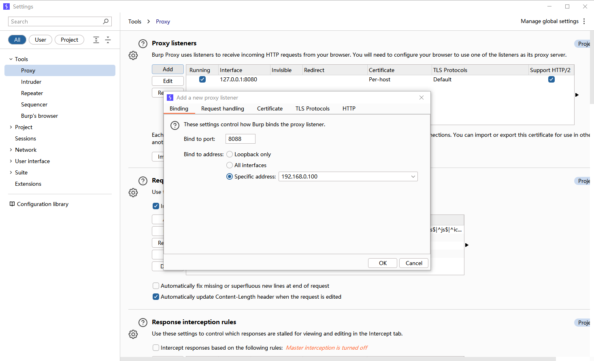
打开安卓模拟器，打开 `WIFI设置页面` -> `已连接的WIFI设置页面` -> `编辑` -> `代理：手动` -> `代理服务器主机名：填入BurpSuite的新代理服务器地址(就是本机的上网网卡地址) | 代理服务器端口：8088` -> `保存`
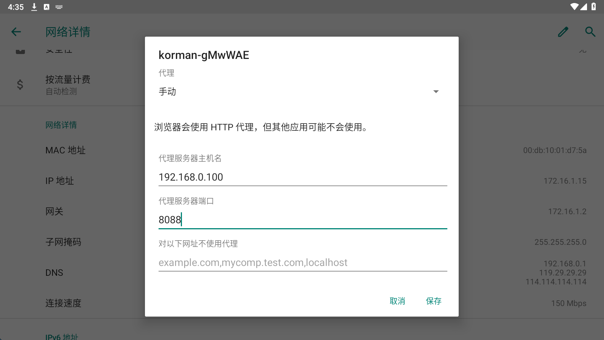
打开 `Via浏览器`，输入：`http://burp` 打开BurpSuite证书下载页面，点击：`CA Certificate` 下载证书，下载保存时将文件名从 `cacert.der`**更改为**`cacert.cer`。

回到模拟器桌面，找到并点击 `设置` -> `安全性和位置信息` -> `加密与凭据` -> `从SD卡安装` -> `点击下载后选择cacert.cer` | 或者在文件目录下找到Download文件夹后选择cacert.cer -> `证书名称：burp` -> `成功安装证书`
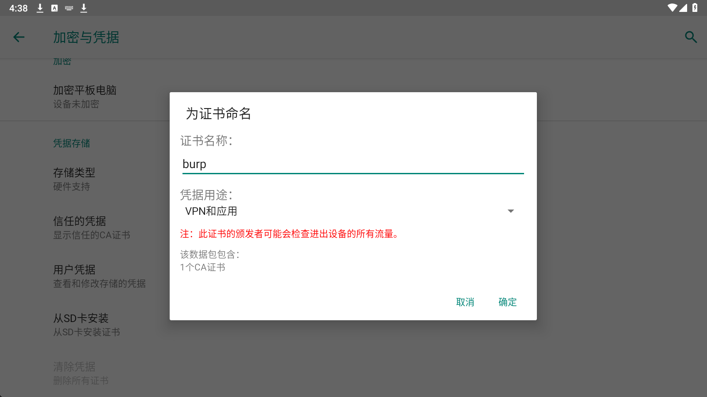

将用户证书更改为系统证书：打开MT管理器，`允许ROOT权限`！
1. 在MT管理器的左侧，打开 `/data/misc/user/0/cacerts-added/` 路径，发现一个类似于`xxxxxxx.0`的文件，这个就是手动安装的`BurpSuite证书文件`。
2. 在MT管理器的右侧，打开 `/system/etc/security/cacerts/`路径，发现一堆类似于`xxxxxxx.0`的文件，这些就是系统证书。
3. 将左侧的文件（用户证书）移动到右面的文件（系统证书）**，这样就**完成了用户证书移动到系统证书的操作！
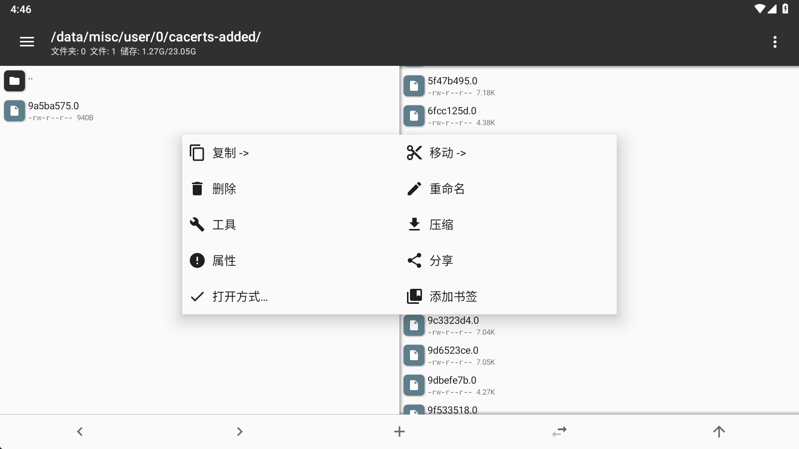

之后，点击设置，安全性和位置信息，加密与凭据，信任的凭据，即可看到 bp 官方的证书：
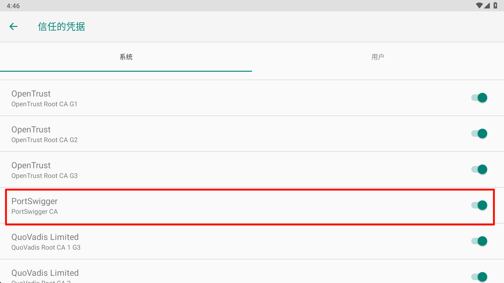

之后打开任意移动应用，进行HTTP网络请求，发现已经成功可以抓到HTTP/HTTPS请求包了！
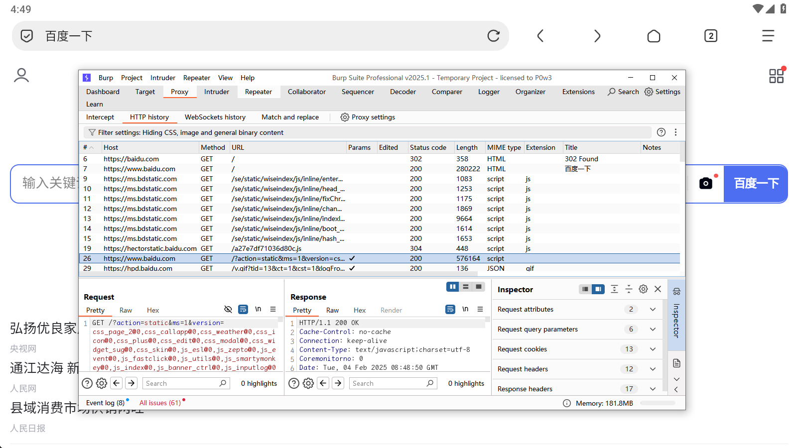

# 设置 Reqable
reqable 下载地址：[客户端下载 | Reqable · API抓包调试 + API测试一站式工具](https://reqable.com/zh-CN/download/)
此工具需要下载手机端与pc端，可以将app的流量转发到pc端中，看起来直观一些。

打开 PC 端软件，安装证书：
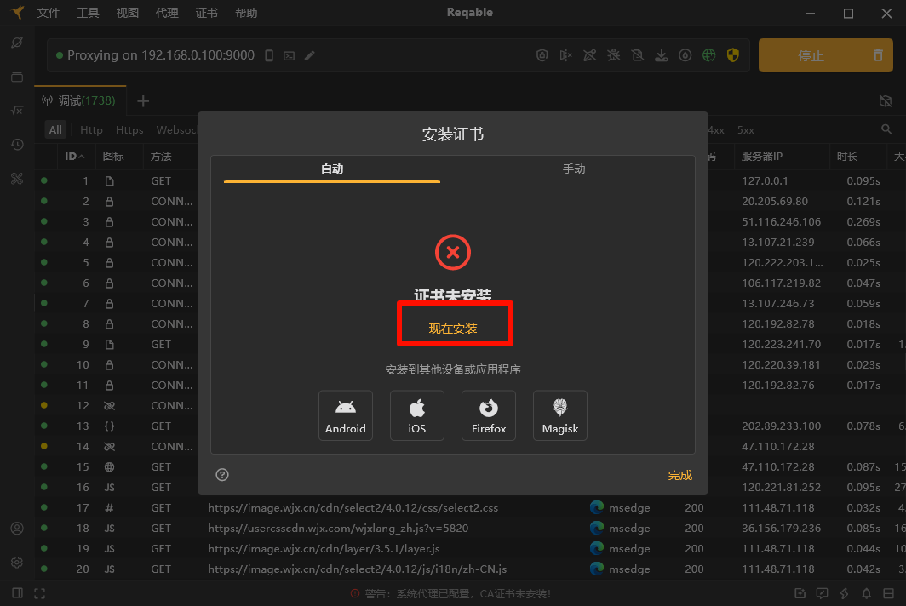

打开安卓端的软件：
选择协同模式：
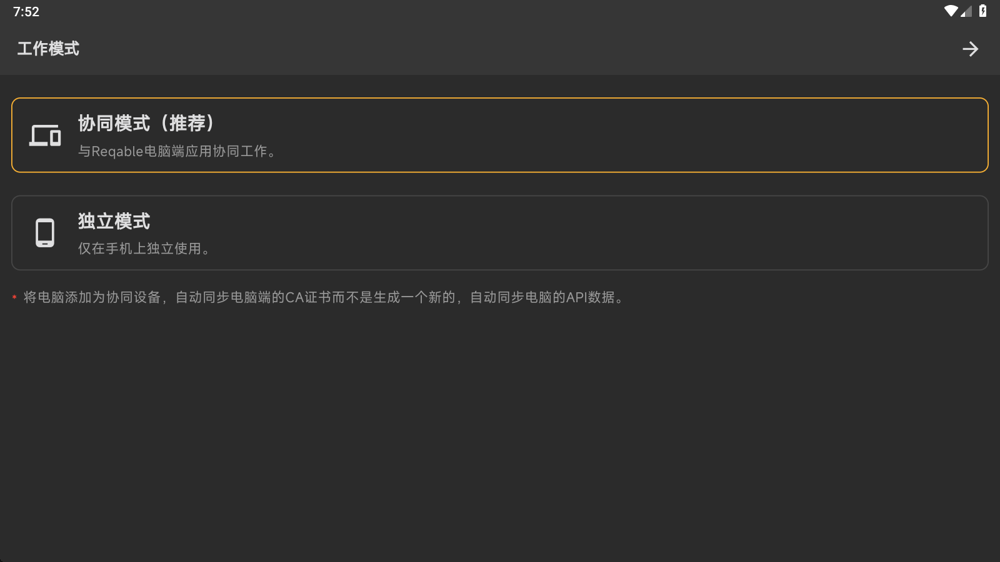

跟着指引扫描 PC 端软件的二维码，完成效果如下：
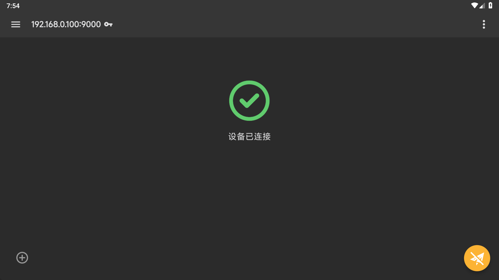
侧边栏-->证书管理-->
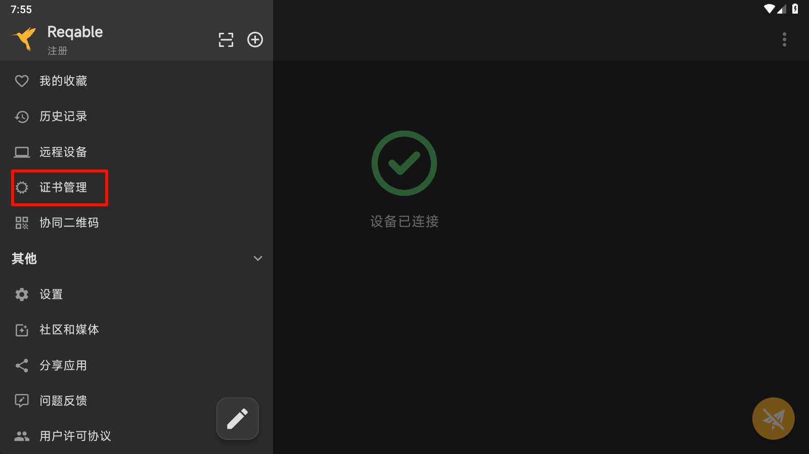
选择安装根证书到本机，点击下载，保存文件，然后使用**mt管理器**，复制进system分区分区，具体目录见下图：
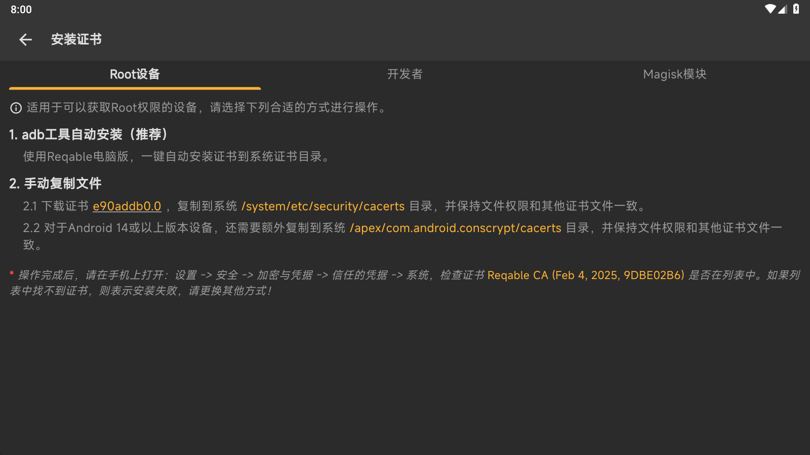
完成之后，证书管理处会显示证书已安装：
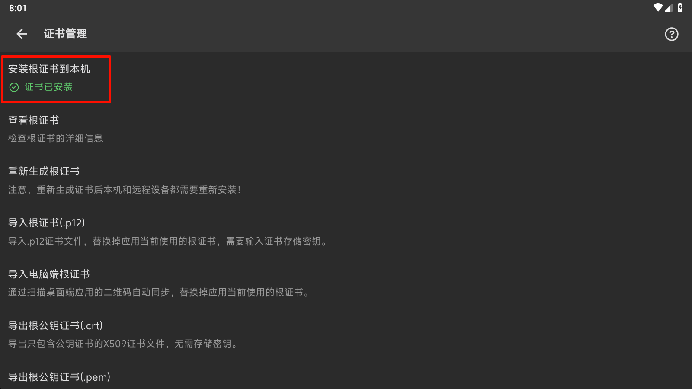
之后，点击设置，安全性和位置信息，加密与凭据，信任的凭据，即可看到 Reqable CA的证书：
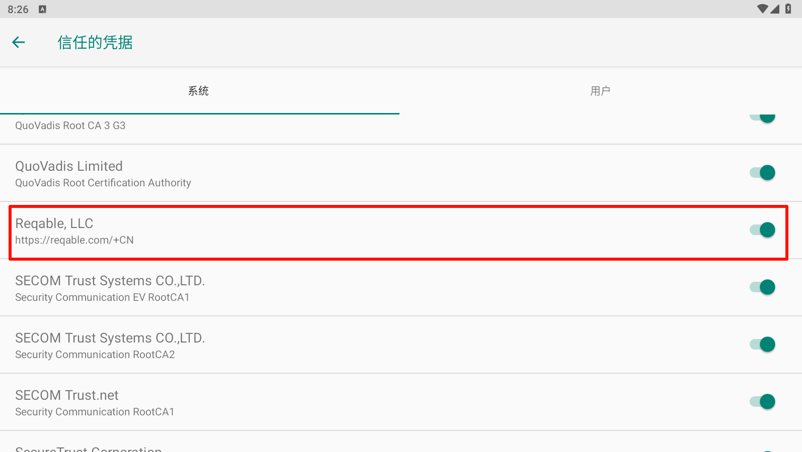
之后返回 app，点击右下角，
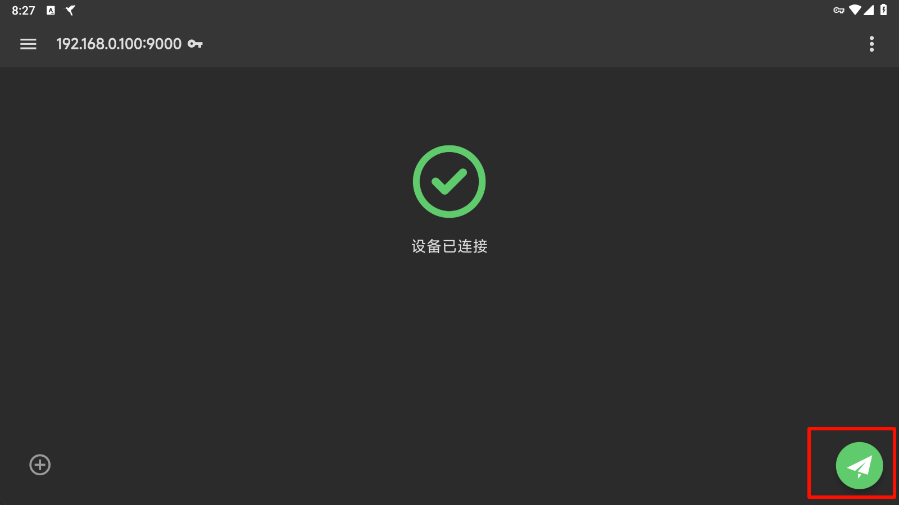
当手机端进入调试模式后，Reqable桌面端也会自动进入调试模式。当在手机端发送网络请求时，在电脑端便可以看到访问的请求流量了。
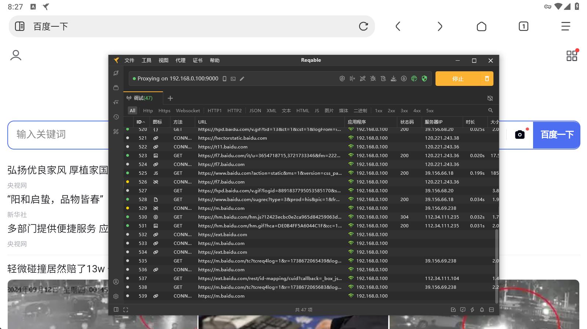
